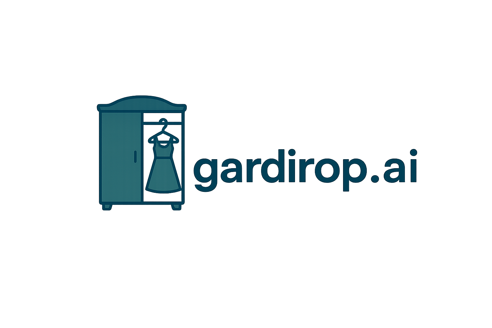
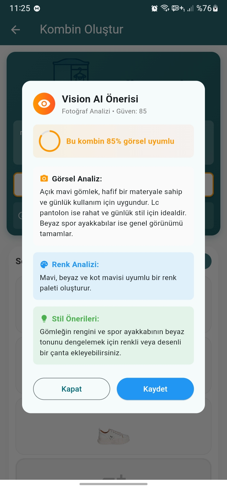
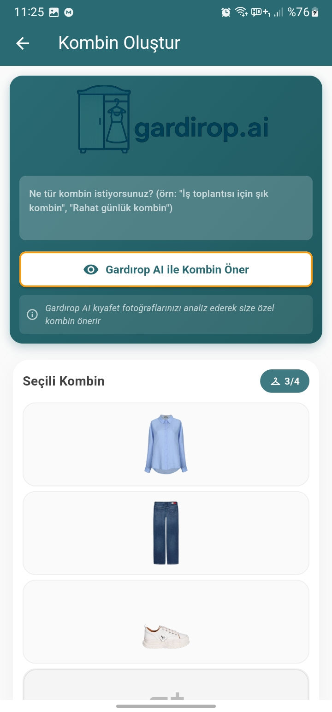
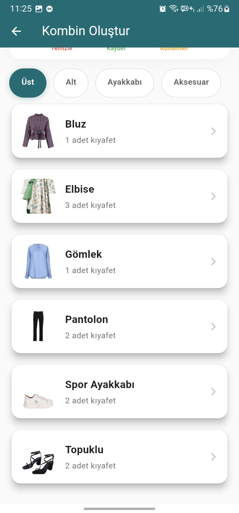
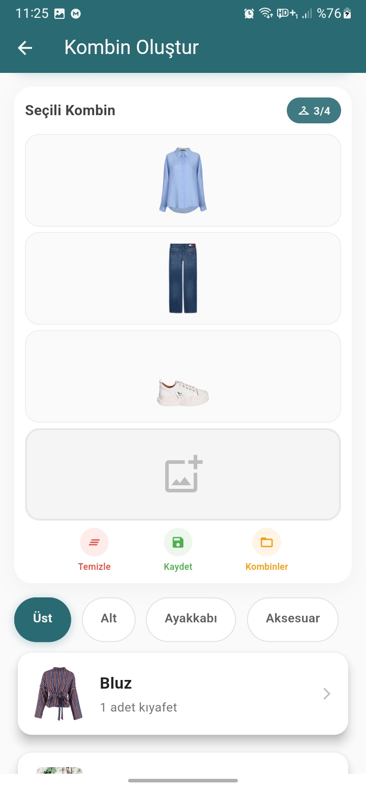
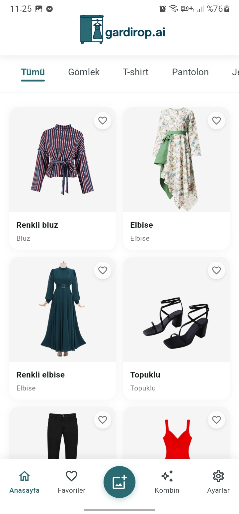
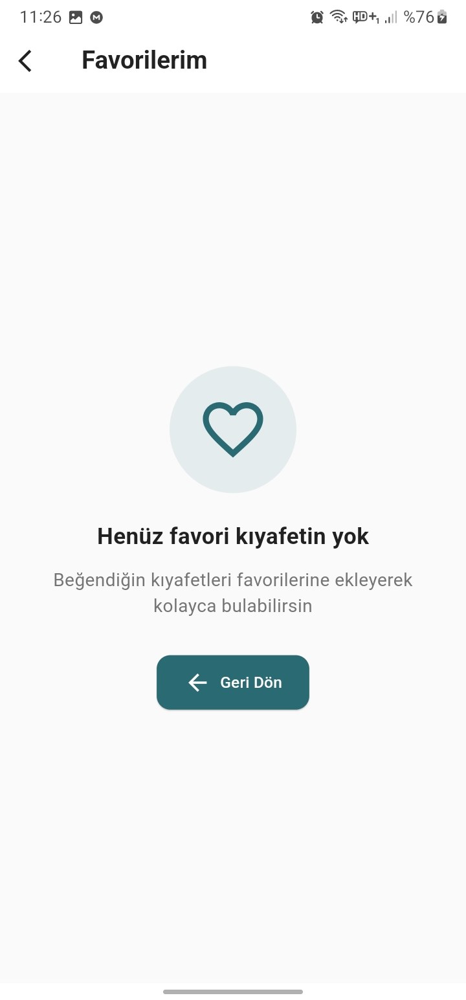
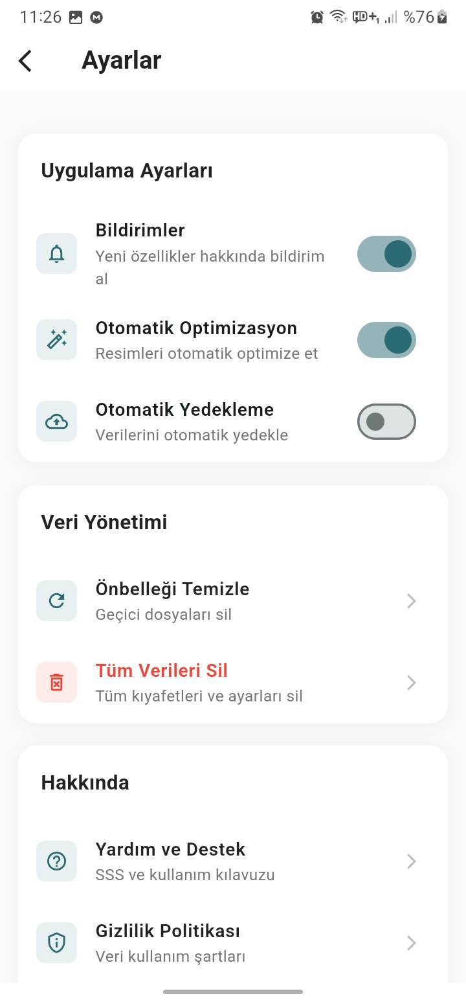
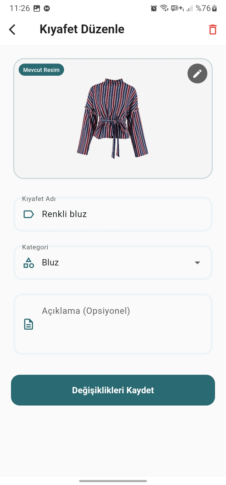
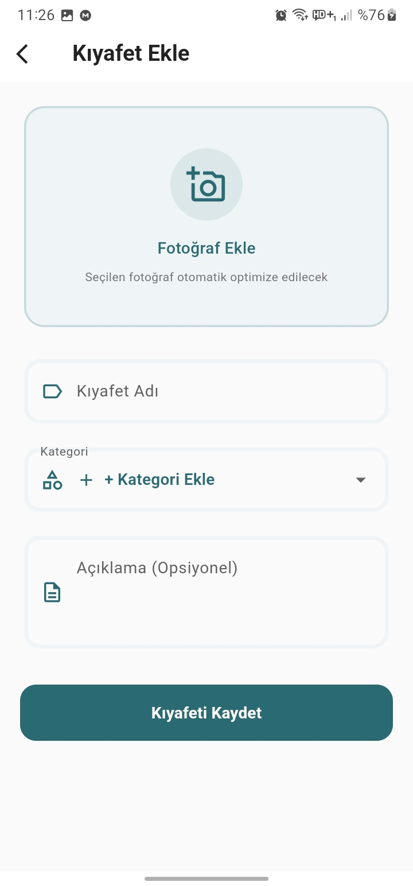

# 👗 Gardirop AI - Akıllı Kombin Uygulaması
<p align="center">
  
</p>
 
### 🇹🇷 Türkçe | 🇺🇸 [English](#english-version)

---

## 🚀 Genel Bakış

**Combiner AI**, yapay zeka teknolojisi ile desteklenen gelişmiş bir kıyafet kombinleme uygulamasıdır. Kullanıcıların gardıroplarını dijitalleştirmelerini, AI destekli kombin önerileri almalarını ve kişiselleştirilmiş stil tavsiyeleri elde etmelerini sağlar.

## ✨ Temel Özellikler

### 🎯 AI Destekli Kombin Önerileri
- **Vision AI Analizi**: ChatGPT-4o ile görsel kıyafet analizi
- **Text AI Önerileri**: ChatGPT-4o-mini ile metin tabanlı kombin önerileri
- **Akıllı Gardırop Analizi**: Kıyafetlerin renk, desen, stil ve mevsim analizı
- **Çoklu Kombin Önerileri**: Tek seferde 3 farklı kombin önerisi

### 📱 Gelişmiş Kıyafet Yönetimi
- **Kamera Entegrasyonu**: Anlık fotoğraf çekme ve galeri seçimi
- **Kategori Sistemi**: 15+ kıyafet kategorisi (Gömlek, Pantolon, Ayakkabı, vb.)
- **Favori Sistemi**: Sevilen kıyafetleri işaretleme
- **Detaylı Filtreler**: Kategori ve alt kategori bazlı filtreleme

### 🧠 Gelişmiş AI Analizi
- **Renk Analizi**: Dominant renklerin otomatik tespiti
- **Desen Tanıma**: Düz, çizgili, puantiyeli, desenli sınıflandırması
- **Stil Belirleme**: Casual, formal, sporty, elegant, trendy kategorileri
- **Mevsim Uygunluğu**: Yazlık, kışlık, geçiş mevsimi analizi
- **Formalite Seviyesi**: Çok rahat'tan çok şık'a kadar 5 seviye

### 💾 Kombin Yönetimi
- **Kombin Kaydetme**: Beğenilen kombinleri kalıcı saklama
- **Kombin Geçmişi**: Önceki kombin önerilerini görüntüleme
- **Detaylı Açıklamalar**: Her kombin için AI açıklamaları ve stil ipuçları

### 🎨 Kişiselleştirilmiş Deneyim
- **Özel Prompt Sistemi**: Kullanıcının istediği tarzda kombin isteme
- **Güven Skoru**: Her kombin önerisi için güvenilirlik puanı
- **Talep Uyumu**: Kullanıcı isteğine ne kadar uygun olduğu puanı

## 🛠️ Teknoloji Altyapısı

### 🎨 Frontend
- **Flutter 3.5+**: Cross-platform mobil uygulama geliştirme
- **Dart**: Modern programlama dili
- **Material Design 3**: Google'ın tasarım rehberi

### 🤖 AI Entegrasyonu
- **OpenAI GPT-4o**: Görsel analiz ve gelişmiş öneriler
- **OpenAI GPT-4o-mini**: Hızlı metin tabanlı öneriler
- **Vision API**: Kıyafet fotoğraflarının detaylı analizi

### 💾 Veritabanı & Depolama
- **SQLite**: Yerel veritabanı çözümü
- **Dosya Sistemi**: Kıyafet fotoğraflarının güvenli depolanması
- **AI Etiketleme**: Genişletilmiş veritabanı şeması

### 📱 Platform Özellikleri
- **Kamera API**: Anlık fotoğraf çekme
- **Galeri Erişimi**: Mevcut fotoğrafları seçme
- **Dosya Paylaşımı**: Kombinleri paylaşma
- **İzin Yönetimi**: Kamera ve depolama izinleri

## 📸 Ekran Görüntüleri / Screenshots

<p align="center">
  
  
  
</p>

<p align="center">
  
  
  
</p>

<p align="center">
  
  
  
</p>

## 🏗️ Proje Mimarisi

### 📁 Dosya Yapısı
```
lib/
├── main.dart                 # Uygulama giriş noktası
├── models/                   # Veri modelleri
│   ├── clothing_item.dart    # Kıyafet veri modeli (AI etiketli)
│   ├── saved_outfit.dart     # Kaydedilmiş kombin modeli
│   └── outfit.dart           # Genel kombin modeli
├── screens/                  # UI ekranları
│   ├── home_screen.dart      # Ana sayfa
│   ├── wardrobe_screen.dart  # Gardırop yönetimi
│   ├── outfit_screen.dart    # Kombin oluşturma (AI entegreli)
│   ├── saved_outfits_screen.dart # Kaydedilmiş kombinler
│   └── add_clothing_screen.dart  # Kıyafet ekleme
├── services/                 # İş mantığı servisleri
│   ├── database_helper.dart  # SQLite veritabanı işlemleri
│   ├── enhanced_chatgpt_service.dart # Vision & Text AI
│   └── advanced_ai_service.dart      # Akıllı gardırop analizi
└── widgets/                  # Yeniden kullanılabilir bileşenler
    └── clothing_slot.dart    # Kıyafet yuvaları
```

### �️ Veritabanı Şeması
```sql
-- Kıyafetler tablosu (AI etiketli)
clothing_items (
  id INTEGER PRIMARY KEY,
  name TEXT NOT NULL,
  category TEXT NOT NULL,
  imagePath TEXT NOT NULL,
  description TEXT,
  is_favorite INTEGER DEFAULT 0,
  ai_analyzed INTEGER DEFAULT 0,
  ai_colors TEXT,          -- "mavi, beyaz, siyah"
  ai_patterns TEXT,        -- "çizgili"
  ai_style TEXT,           -- "casual"
  ai_season TEXT,          -- "yazlık"
  ai_formality TEXT,       -- "rahat"
  ai_material TEXT,        -- "pamuk"
  ai_confidence INTEGER,   -- 1-100 arası
  ai_analysis_date TEXT
);

-- Kaydedilmiş kombinler
saved_outfits (
  id INTEGER PRIMARY KEY,
  name TEXT NOT NULL,
  top_item_id INTEGER,
  bottom_item_id INTEGER,
  shoes_item_id INTEGER,
  accessory_item_id INTEGER,
  FOREIGN KEY (top_item_id) REFERENCES clothing_items(id),
  FOREIGN KEY (bottom_item_id) REFERENCES clothing_items(id),
  FOREIGN KEY (shoes_item_id) REFERENCES clothing_items(id),
  FOREIGN KEY (accessory_item_id) REFERENCES clothing_items(id)
);
```

## 🎯 AI Algoritmaları

### 🔍 İki Aşamalı AI Mimarisi

#### 1️⃣ **Gardırop Analizi (Vision AI)**
```dart
// Toplu kıyafet analizi
await AdvancedAIService.analyzeWardrobe();

// Her kıyafet için:
// • Renk analizi (dominant renkler)
// • Desen tanıma (düz, çizgili, desenli)
// • Stil kategorisi (casual, formal, sporty)
// • Mevsim uygunluğu
// • Formalite seviyesi
// • Materyal tahmin
```

#### 2️⃣ **Kombin Üretimi (Text AI)**
```dart
// Analiz edilmiş verilerle kombin önerisi
final outfits = await AdvancedAIService.generateSmartOutfits(
  customPrompt: "İş toplantısı için formal kombin",
  outfitCount: 3,
);

// Çıktı: 3 farklı kombin önerisi
// • Her biri farklı stil yaklaşımı
// • Renk uyumu garantili
// • Mevsim/formalite uygun
```

### 🎨 Vision AI Analiz Süreci
1. **Görsel Yükleme**: Kıyafet fotoğrafları base64 formatında
2. **GPT-4o Analizi**: Çoklu görsel işleme
3. **Etiket Çıkarımı**: Structured JSON response
4. **Veritabanı Kayıt**: AI etiketlerinin saklanması
5. **Güven Skoru**: Her analiz için güvenilirlik puanı

### 💬 Text AI Kombin Mantığı
1. **Analiz Verileri**: Önceden işlenmiş kıyafet etiketleri
2. **Kullanıcı Prompt**: "İş toplantısı", "rahat gün", "romantik akşam"
3. **Stil Uyumu**: Renk, desen, formalite uyumluluğu
4. **Çeşitlilik**: Her öneride farklı yaklaşım
5. **Açıklama**: Detaylı stil analizi ve ipuçları

## 🎨 Kullanıcı Arayüzü

### 🏠 Ana Ekran
- **Hızlı Erişim**: Gardırop, Kombinler, AI Önerileri
- **İstatistikler**: Toplam kıyafet, kaydedilmiş kombin sayısı
- **Güncel Öneriler**: Son AI önerilerini görüntüleme

### 👕 Gardırop Yönetimi
- **Kategori Filtresi**: 15+ kıyafet kategorisi
- **Görsel Galeri**: Grid layout ile kıyafet galerisi
- **Hızlı Ekleme**: Kamera veya galeri ile anında ekleme
- **Favori İşaretleme**: Sevilen kıyafetleri öne çıkarma

### 🎯 AI Kombin Ekranı
- **Kombin Alanı**: 4 slot (Üst, Alt, Ayakkabı, Aksesuar)
- **AI Prompt**: Özel istek yazma alanı
- **Vision AI**: Görsel analiz ile kombin önerisi
- **Smart AI**: Gelişmiş analiz ile çoklu öneriler
- **Açıklama Paneli**: AI'ın neden bu kombini seçtiğini açıklama

### 💾 Kaydedilmiş Kombinler
- **Kombin Galerisi**: Kaydedilmiş tüm kombinler
- **Mini Görünüm**: Her kombin için küçük önizleme
- **Detay Görünümü**: Büyük kombin görüntüleme
- **Silme/Düzenleme**: Kombin yönetimi

## 🔧 Kurulum ve Çalıştırma

### 📋 Gereksinimler
- **Flutter SDK**: 3.5.0 veya üzeri
- **Dart SDK**: 3.5.0 veya üzeri
- **Android Studio / VS Code**: IDE
- **Android**: API 21+ (Android 5.0)
- **iOS**: iOS 12.0+

### 🚀 Kurulum Adımları

1. **Projeyi Klonlayın**
```bash
git clone [repository-url]
cd combiner_ai
```

2. **Bağımlılıkları Yükleyin**
```bash
flutter pub get
```

3. **API Anahtarını Yapılandırın**
```dart
// lib/services/enhanced_chatgpt_service.dart
static const String _apiKey = 'OPENAI_API_KEY_BURAYA';
```

4. **Uygulamayı Çalıştırın**
```bash
flutter run
```

### 📱 Platform Ayarları

#### Android İzinleri (android/app/src/main/AndroidManifest.xml)
```xml
<uses-permission android:name="android.permission.CAMERA" />
<uses-permission android:name="android.permission.WRITE_EXTERNAL_STORAGE" />
<uses-permission android:name="android.permission.READ_EXTERNAL_STORAGE" />
<uses-permission android:name="android.permission.INTERNET" />
```

#### iOS İzinleri (ios/Runner/Info.plist)
```xml
<key>NSCameraUsageDescription</key>
<string>Kıyafet fotoğrafları çekmek için kamera erişimi gerekli</string>
<key>NSPhotoLibraryUsageDescription</key>
<string>Galeri fotoğraflarını seçmek için erişim gerekli</string>
```

## 🎮 Kullanım Rehberi

### 1️⃣ **İlk Kurulum**
1. Uygulamayı açın
2. Ana sayfadan "Gardırop" seçin
3. "+" butonu ile ilk kıyafetinizi ekleyin
4. Kamera ile fotoğraf çekin veya galeriden seçin
5. Kıyafet adını ve kategorisini belirleyin

### 2️⃣ **Gardırop Analizi**
1. "Kombinler" ekranına gidin
2. "Gardırop Analizi" butonuna tıklayın
3. AI tüm kıyafetlerinizi analiz edecek
4. Renk, desen, stil etiketleri otomatik eklenecek

### 3️⃣ **AI Kombin Önerisi**
1. Kombinler ekranında prompt yazın ("İş için şık kombin")
2. **Vision AI**: Anlık görsel analiz
3. **Smart AI**: 3 farklı kombin önerisi
4. Beğendiğiniz kombini kaydedin

### 4️⃣ **Kombin Yönetimi**
1. "Kaydedilmiş Kombinler" ekranına gidin
2. Tüm kombinlerinizi görüntüleyin
3. Detaylarını inceleyin
4. İstemediğinizi silin

## 🔍 Sorun Giderme

### ❌ Sık Karşılaşılan Sorunlar

#### **1. AI Önerisi Alınamıyor**
```
Çözüm:
• İnternet bağlantınızı kontrol edin
• API anahtarının doğru olduğundan emin olun
• Kıyafet sayınızın yeterli olduğunu kontrol edin (min 3-4)
```

#### **2. Kamera Çalışmıyor**
```
Çözüm:
• Uygulama izinlerini kontrol edin
• Cihazı yeniden başlatın
• Uygulamayı yeniden yükleyin
```

#### **3. Fotoğraflar Kaydedilmiyor**
```
Çözüm:
• Depolama izinlerini kontrol edin
• Cihazda yeterli alan olduğundan emin olun
• Uygulama verilerini temizleyin
```

### 🔧 Debug Modu
```bash
# Detaylı log için
flutter run --debug

# Performance analizi
flutter run --profile
```

## 📊 Performans Özellikleri

### ⚡ Hız Metrikleri
- **Uygulama Başlatma**: <3 saniye
- **Vision AI Analizi**: 5-10 saniye (25 kıyafet)
- **Text AI Önerisi**: 2-5 saniye
- **Veritabanı Sorguları**: <100ms
- **Fotoğraf Yükleme**: <2 saniye

### 💾 Depolama Optimizasyonu
- **Fotoğraf Sıkıştırma**: JPEG 80% kalite
- **Veritabanı Boyutu**: ~10MB (100 kıyafet)
- **Cache Yönetimi**: Otomatik temizlik
- **Offline Kullanım**: Temel özellikler mevcut

### 🔋 Pil Optimizasyonu
- **Background Processing**: Minimum
- **Network Calls**: Sadece gerektiğinde
- **Camera Usage**: Optimize edilmiş
- **UI Animations**: 60 FPS hedefi

---

## 📄 Lisans

**© 2025 OlgunSoftware - Tüm Hakları Saklıdır**

Bu proje telif hakkı ile korunmaktadır. Bu yazılımın herhangi bir kısmının kopyalanması, değiştirilmesi, dağıtılması veya yeniden yayınlanması **kesinlikle yasaktır**.

### ⚖️ Yasal Uyarı
Bu yazılımın izinsiz kullanımı telif hakkı ihlali oluşturur ve yasal işlem başlatılmasına sebep olur.

---

# 🇺🇸 English Version {#english-version}

## 🚀 Overview

**Gardirop AI** is an advanced clothing combination application powered by artificial intelligence technology. It enables users to digitize their wardrobes, receive AI-powered outfit recommendations, and get personalized style advice.

## ✨ Key Features

### 🎯 AI-Powered Outfit Recommendations
- **Vision AI Analysis**: Visual clothing analysis with ChatGPT-4o
- **Text AI Suggestions**: Text-based outfit recommendations with ChatGPT-4o-mini
- **Smart Wardrobe Analysis**: Color, pattern, style, and season analysis of clothing
- **Multiple Outfit Suggestions**: 3 different outfit recommendations at once

### 📱 Advanced Clothing Management
- **Camera Integration**: Instant photo capture and gallery selection
- **Category System**: 15+ clothing categories (Shirt, Pants, Shoes, etc.)
- **Favorite System**: Mark favorite clothing items
- **Detailed Filters**: Category and sub-category based filtering

### 🧠 Advanced AI Analysis
- **Color Analysis**: Automatic detection of dominant colors
- **Pattern Recognition**: Plain, striped, polka dot, patterned classification
- **Style Determination**: Casual, formal, sporty, elegant, trendy categories
- **Season Suitability**: Summer, winter, transitional season analysis
- **Formality Level**: 5 levels from very casual to very formal

### 💾 Outfit Management
- **Outfit Saving**: Permanently save favorite outfits
- **Outfit History**: View previous outfit recommendations
- **Detailed Descriptions**: AI explanations and style tips for each outfit

### 🎨 Personalized Experience
- **Custom Prompt System**: Request outfits in the user's desired style
- **Confidence Score**: Reliability score for each outfit recommendation
- **Request Match**: Score of how well it matches the user's request

## 🛠️ Technology Stack

### 🎨 Frontend
- **Flutter 3.5+**: Cross-platform mobile app development
- **Dart**: Modern programming language
- **Material Design 3**: Google's design guidelines

### 🤖 AI Integration
- **OpenAI GPT-4o**: Visual analysis and advanced recommendations
- **OpenAI GPT-4o-mini**: Fast text-based recommendations
- **Vision API**: Detailed analysis of clothing photos

### 💾 Database & Storage
- **SQLite**: Local database solution
- **File System**: Secure storage of clothing photos
- **AI Tagging**: Extended database schema

### 📱 Platform Features
- **Camera API**: Instant photo capture
- **Gallery Access**: Select existing photos
- **File Sharing**: Share outfits
- **Permission Management**: Camera and storage permissions

## 🏗️ Project Architecture

### 📁 File Structure
```
lib/
├── main.dart                 # Application entry point
├── models/                   # Data models
│   ├── clothing_item.dart    # Clothing data model (AI tagged)
│   ├── saved_outfit.dart     # Saved outfit model
│   └── outfit.dart           # General outfit model
├── screens/                  # UI screens
│   ├── home_screen.dart      # Home page
│   ├── wardrobe_screen.dart  # Wardrobe management
│   ├── outfit_screen.dart    # Outfit creation (AI integrated)
│   ├── saved_outfits_screen.dart # Saved outfits
│   └── add_clothing_screen.dart  # Add clothing
├── services/                 # Business logic services
│   ├── database_helper.dart  # SQLite database operations
│   ├── enhanced_chatgpt_service.dart # Vision & Text AI
│   └── advanced_ai_service.dart      # Smart wardrobe analysis
└── widgets/                  # Reusable components
    └── clothing_slot.dart    # Clothing slots
```

### 🗄️ Database Schema
```sql
-- Clothing items table (AI tagged)
clothing_items (
  id INTEGER PRIMARY KEY,
  name TEXT NOT NULL,
  category TEXT NOT NULL,
  imagePath TEXT NOT NULL,
  description TEXT,
  is_favorite INTEGER DEFAULT 0,
  ai_analyzed INTEGER DEFAULT 0,
  ai_colors TEXT,          -- "blue, white, black"
  ai_patterns TEXT,        -- "striped"
  ai_style TEXT,           -- "casual"
  ai_season TEXT,          -- "summer"
  ai_formality TEXT,       -- "casual"
  ai_material TEXT,        -- "cotton"
  ai_confidence INTEGER,   -- 1-100 range
  ai_analysis_date TEXT
);

-- Saved outfits
saved_outfits (
  id INTEGER PRIMARY KEY,
  name TEXT NOT NULL,
  top_item_id INTEGER,
  bottom_item_id INTEGER,
  shoes_item_id INTEGER,
  accessory_item_id INTEGER,
  FOREIGN KEY (top_item_id) REFERENCES clothing_items(id),
  FOREIGN KEY (bottom_item_id) REFERENCES clothing_items(id),
  FOREIGN KEY (shoes_item_id) REFERENCES clothing_items(id),
  FOREIGN KEY (accessory_item_id) REFERENCES clothing_items(id)
);
```

## 🎯 AI Algorithms

### 🔍 Two-Phase AI Architecture

#### 1️⃣ **Wardrobe Analysis (Vision AI)**
```dart
// Batch clothing analysis
await AdvancedAIService.analyzeWardrobe();

// For each clothing item:
// • Color analysis (dominant colors)
// • Pattern recognition (plain, striped, patterned)
// • Style category (casual, formal, sporty)
// • Season suitability
// • Formality level
// • Material estimation
```

#### 2️⃣ **Outfit Generation (Text AI)**
```dart
// Outfit recommendation with analyzed data
final outfits = await AdvancedAIService.generateSmartOutfits(
  customPrompt: "Formal outfit for business meeting",
  outfitCount: 3,
);

// Output: 3 different outfit recommendations
// • Each with different style approach
// • Guaranteed color harmony
// • Season/formality appropriate
```

## 🔧 Installation and Setup

### 📋 Requirements
- **Flutter SDK**: 3.5.0 or higher
- **Dart SDK**: 3.5.0 or higher
- **Android Studio / VS Code**: IDE
- **Android**: API 21+ (Android 5.0)
- **iOS**: iOS 12.0+

### 🚀 Installation Steps

1. **Clone the Project**
```bash
git clone [repository-url]
cd combiner_ai
```

2. **Install Dependencies**
```bash
flutter pub get
```

3. **Configure API Key**
```dart
// lib/services/enhanced_chatgpt_service.dart
static const String _apiKey = 'YOUR_OPENAI_API_KEY_HERE';
```

4. **Run the Application**
```bash
flutter run
```

## 📊 Performance Features

### ⚡ Speed Metrics
- **App Launch**: <3 seconds
- **Vision AI Analysis**: 5-10 seconds (25 items)
- **Text AI Recommendation**: 2-5 seconds
- **Database Queries**: <100ms
- **Photo Upload**: <2 seconds

### 💾 Storage Optimization
- **Photo Compression**: JPEG 80% quality
- **Database Size**: ~10MB (100 items)
- **Cache Management**: Automatic cleanup
- **Offline Usage**: Basic features available

---

## 📞 İletişim / Contact

**OlgunSoftware**
- 📧 Email: [email@example.com]
- 🌐 Website: [website-url]
- 📱 GitHub: [github-profile]

---

**Bu proje özel mülkiyettir ve hiçbir açık kaynak lisansı altında değildir.**
**This project is proprietary and is not under any open source license.**
